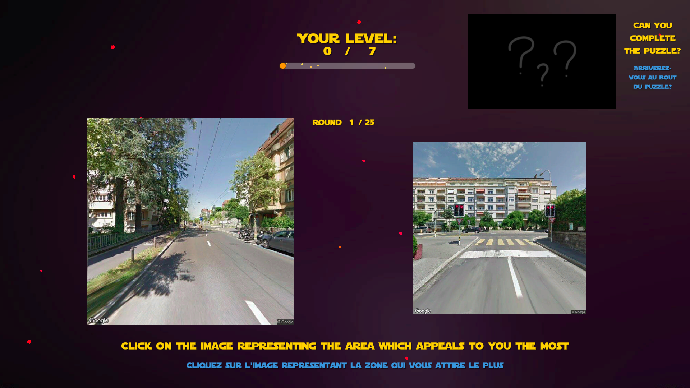
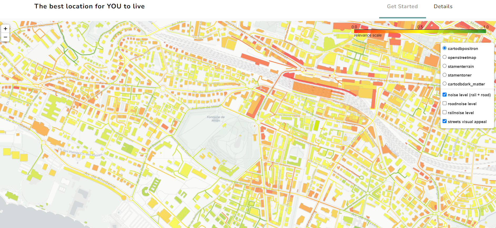

# The Best Location for You to Live

This project aims at building a tool that allows anyone to find their ideal residence place in a given city by specifying their personal level of importance for the location's visual appeal and environmental parameters.
This repository mainly contains the steps followed to build a model able to evaluate a picture's appeal by means of image analysis. An interactive map is also available to see the application on a city, with different layers for environmental parameters.

## Project Documentation

The project's report, as well as the pitch presentation, can be found under the folder ***Documentation***. The report will guide you through the adventure of the project, while explaining choices behind data preprocessing, feature selection, models, and many more...

__Foreword note:__ if you get a dependency error while running a notebook, please run this command, either in a notebook cell or in the terminal:
```
pip install <the missing dependency>
```
## Generalizable Model
On this repository, you can use and replicate models for a given location. By going into the ***GeneralizableModel*** folder you will find 4 notebooks, each of them corresponding to a step of the procedure to get the appeal of your selected city streets. By following the notebook order and changing the input/output path at the beginning of each notebook you can obtain the desired results without needing to understand how the code works.

- **1-GettingStreetViews**: allows to get the streetviews for your chosen city. The steps carried out in this notebook follows the process of the ***ImagesAcquisition*** folder (see below). 
- **2-ImagesSegmentation**: allows to segment all of the images collected from the notebook 1. The step here follows the procedure detailed in ***DataProcessing/ImageSegmentation.ipynb***
- **3-ObjectRecognition**: allows to get the objects (cars, buses ...) within the images. The step here follows the procedure detailed in ***DataProcessing/ObjectRecognitionYoloV3.ipynb*** 
- **4-Evaluate_Appeal**: allows to make appeal predictions of the images by using the training dataset weights. In this case, the training dataset contains Lausanne streetviews labeled through survey results. You can also go to the ***ModelSelection*** folder if you want to use another model for the predictions.

If you want to go in depth you'll need to check the other folders of the repository and follow the next sections.

## Recreating the Results on Lausanne

To retrace our study on the images already obtained in the training area in Lausanne, you can follow these steps:

* Unzip the file in ***Data/CleanedImages/Images.zip*** to recover the 458 images. (Please put them directly in the folder ***Data/CleanedImages***).

* Run the 3 notebooks ***DataProcessing*** to extract these images' features and clean the survey results (these files are already in the folder ***Data*** but you can re-generate them).

* Run the notebook ***ModelSelection/FinalModel.ipynb*** to apply the models on this dataset and see some analysis.

If you want to start fresh from a completely new dataset please follow the next section.

## Step by Step Procedure on a New Data Set

__Foreword note:__ If you do not choose to run the exact same notebooks by using the files already created by running some code, you will need to unzip files. Specifically, the raw streetview images are in ***Data/RawImages***, the cleaned images in ***Data/CleanedImages*** and the segmented images in ***Data/SegmentedImages***. Otherwise, running the notebooks will generate them.

### Images Acquisition
By going through the ***ImagesAcquisition*** folder, you will be able to change the location of the focused area where you want to get images from. To do so, you will need to get a Google API to access to Google Street View, you can get an API key for three free months by following this link: [get-api-key](https://developers.google.com/maps/documentation/javascript/get-api-key). After gathering images from the chosen location (in ***Data/RawImages***), you will be able to clean your images using ***ImagesAcquisitionClusterImagesVGG16.py*** if these ones are not good enough for you. Also note that if you do choose to run VGG16 to further clean your images, you will need to download weigths that are used to train VGG16. These weights can be pulled by running the following command:
```
wget https://pjreddie.com/media/files/yolov3.weights
```

__Important:__ Please put your final cleaned images in (in ***Data/CleanedImages***). They should be named from *0.jpg* to *N.jpg*. In the rest of the notebooks, you should specify the number of images and their dimensions. 

### Survey Results
A [survey](https://toto1205.itch.io/ml2-project) was implemented to gather data on people's preferences. Here is a screenshot taken from it:

<p align="center">
  
</p>

The models will use these results as foundation for finding correlations. The dataset used for training tried to represent many types of areas with variances in images. This way, your models will work from a representative sample. However, if some of your views are very far from this sample, you might end up with unexpected results.
 
### Features
After having cleaned your images (now put in ***Data/CleanedImages***), you will need to get features to run a model from it. The best features that were kept while doing the modeling on the former dataset were 6 colors (green, grey, black, white, blue and red), and an object feature which is the sum of sizes of the detected objects on an image. The first 6 features can be found by using the file ***DataProcessing/ImageSegmentation.ipynb***, and the last object feature is computed by running ***DataProcessing/ObjectRecognitionYoloV3.ipynb***. By doing this, you will write csv files which summarize features for your own images.

### Model Selection
Many models have been computed to get the best appeal predictions, and you can find what is the best possible regression and/or classification by jumping into ***ModelSelection/FinalModel***.ipynb. 

### User Interface
A user interface was developed to allow individuals to tune their parameters and find their best location to live from the studied images. An example of the map is shown below:

<p align="center">
  
</p>

With the obtained appeals of Street Views within your chosen area, you can now map them using **folium** and **OSMnx** library. The [website](https://the-best-location-to-live.github.io/the-best-location-to-live/) will give you the visual preferences on where are the best location to live in, considering the Street Views.

## Authors

* [Paul Habert](https://github.com/plhbt)
* [Yannick Neypatraiky](https://github.com/nyannickandre)
* [Thomas Rimbot](https://github.com/Thomas-debug-creator)

## Acknowledgments
We would like to thank the Laboratoire d’Economie Urbaine et de l’Environnement, and more particularly Professor Philippe Thalmann and his doctoral student Adam Swietek for their precious advice. Many thanks to everyone who answered the discrete choices survey, and to Professors Jamila Sam and Barbara Jobstmann for allowing us to present this project to their class.


